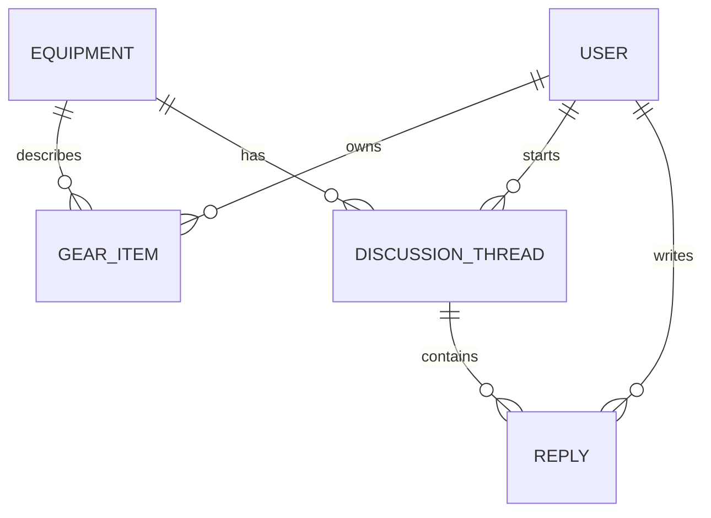

# Entity Model

## Entity Relationship Diagram

---

### USER

Represents a registered platform member who can manage a gear inventory and participate in community discussions.

| Attribute    | Description                                | Data Type | Length/Precision | Validation Rules           |
|--------------|--------------------------------------------|-----------|------------------|----------------------------|
| id           | Unique identifier                          | Long      | 19               | Primary Key, Sequence      |
| username     | Unique public display name                 | String    | 50               | Not Null, Unique           |
| email        | Email address used for authentication      | String    | 255              | Not Null, Unique, Format: Email |
| password     | bcrypt-hashed password                     | String    | 60               | Not Null                   |
| bio          | Optional personal description              | String    | 500              | Optional                   |
| public_inventory | Whether the gear inventory is publicly visible | Boolean | 1            | Not Null                   |
| created_at   | Timestamp when the account was created     | DateTime  | -                | Not Null                   |

**Constraints:** password must be stored as a bcrypt hash with cost factor ≥ 12 (NFR-005).

---

### EQUIPMENT

Represents a specific piece of studio equipment in the shared catalog, independent of any individual owner.

| Attribute    | Description                                      | Data Type | Length/Precision | Validation Rules                    |
|--------------|--------------------------------------------------|-----------|------------------|-------------------------------------|
| id           | Unique identifier                                | Long      | 19               | Primary Key, Sequence               |
| name         | Device model name                                | String    | 150              | Not Null                            |
| manufacturer | Name of the equipment manufacturer               | String    | 100              | Not Null                            |
| category     | Equipment type classification                    | String    | 50               | Not Null, Values: Synth, Effect, Keyboard, Interface, Other |
| description  | Optional technical description or specifications | String    | 2000             | Optional                            |

**Constraints:** The combination of name and manufacturer must be unique.

---

### GEAR_ITEM

Represents a specific piece of equipment owned by a user, linking their personal inventory entry to the equipment catalog.

| Attribute   | Description                                        | Data Type | Length/Precision | Validation Rules                      |
|-------------|----------------------------------------------------|-----------|------------------|---------------------------------------|
| id          | Unique identifier                                  | Long      | 19               | Primary Key, Sequence                 |
| user_id     | Owner of this gear item                            | Long      | 19               | Not Null, Foreign Key (USER.id)       |
| equipment_id | Catalog entry this item is linked to              | Long      | 19               | Optional, Foreign Key (EQUIPMENT.id)  |
| name        | Free-text device name when not linked to catalog   | String    | 150              | Optional                              |
| category    | Equipment type assigned by the user                | String    | 50               | Not Null, Values: Synth, Effect, Keyboard, Interface, Other |
| notes       | Personal notes or observations about this item     | String    | 1000             | Optional                              |
| created_at  | Timestamp when the item was added to the inventory | DateTime  | -                | Not Null                              |

**Constraints:** Either equipment_id or name must be provided (not both null).

---

### DISCUSSION_THREAD

Represents a community discussion thread scoped to a specific piece of equipment.

| Attribute    | Description                                      | Data Type | Length/Precision | Validation Rules                        |
|--------------|--------------------------------------------------|-----------|------------------|-----------------------------------------|
| id           | Unique identifier                                | Long      | 19               | Primary Key, Sequence                   |
| equipment_id | Equipment this thread belongs to                 | Long      | 19               | Not Null, Foreign Key (EQUIPMENT.id)    |
| author_id    | User who started the thread                      | Long      | 19               | Not Null, Foreign Key (USER.id)         |
| title        | Short descriptive title of the discussion        | String    | 200              | Not Null, Min: 5                        |
| body         | Opening post content                             | String    | 10000            | Not Null, Min: 10                       |
| created_at   | Timestamp when the thread was created            | DateTime  | -                | Not Null                                |
| last_reply_at | Timestamp of the most recent reply (for sorting) | DateTime  | -               | Optional                                |

---

### REPLY

Represents a reply posted by a user within a discussion thread.

| Attribute         | Description                               | Data Type | Length/Precision | Validation Rules                              |
|-------------------|-------------------------------------------|-----------|------------------|-----------------------------------------------|
| id                | Unique identifier                         | Long      | 19               | Primary Key, Sequence                         |
| discussion_thread_id | Thread this reply belongs to           | Long      | 19               | Not Null, Foreign Key (DISCUSSION_THREAD.id)  |
| author_id         | User who wrote the reply                  | Long      | 19               | Not Null, Foreign Key (USER.id)               |
| body              | Reply content                             | String    | 10000            | Not Null, Min: 1                              |
| created_at        | Timestamp when the reply was posted       | DateTime  | -                | Not Null                                      |
